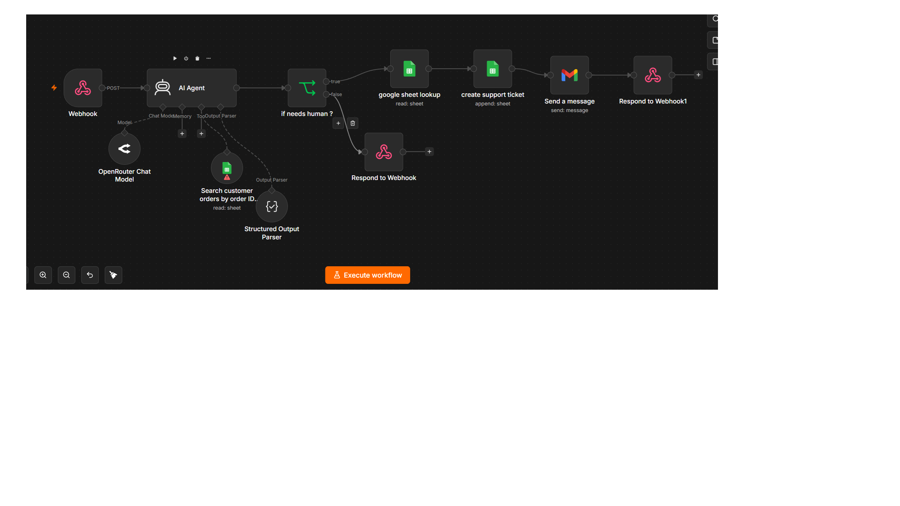

# 🤖 AI Customer Support Agent

An AI-powered customer support automation workflow built with **n8n**. The system receives customer requests through a webhook, uses an AI agent to understand the request, retrieves order information from Google Sheets when needed, and automatically escalates complex requests to human support.

---

## 📌 Overview

This project demonstrates an automated customer support system designed for e-commerce businesses.

The AI agent can:

- Understand customer support messages
- Extract order IDs from customer requests
- Search order information using Google Sheets
- Provide automated responses for common requests
- Detect when human intervention is required
- Create support tickets automatically
- Notify the support team through Gmail
- Return structured JSON responses through a webhook

---

## 🏗️ Workflow Architecture

```text
Customer
   │
   ▼
Webhook
   │
   ▼
AI Agent
   │
   ├──────────────► Google Sheets
   │                Order Lookup Tool
   │
   ▼
Structured Output
   │
   ▼
IF: Needs Human?
   │
   ├── FALSE ─────► Respond to Webhook
   │
   └── TRUE
          │
          ▼
     Google Sheets
     Order Lookup
          │
          ▼
     Create Support Ticket
          │
          ▼
        Gmail
          │
          ▼
     Respond to Webhook




     ✨ Features
AI Customer Support

The AI agent processes incoming customer messages and determines the appropriate response.

Order Lookup

When a customer provides an order ID, the AI agent can use a Google Sheets tool to retrieve the corresponding order information.

Human Escalation

Requests that require human assistance are automatically detected using structured output.

Automated Ticket Creation

When human intervention is required, the workflow creates a support ticket in Google Sheets.

Email Notification

The support team receives an automated Gmail notification when a new ticket is created.

Structured Output

The AI agent uses a structured JSON schema to ensure reliable and predictable workflow execution.

Webhook API

The workflow exposes a webhook endpoint that allows external applications to send customer support requests.


Tech Stack
n8n — Workflow automation
AI Agents — Customer request understanding and decision making
OpenRouter — LLM provider
Google Sheets — Order database and support ticket storage
Gmail — Support team notifications
Webhooks — API communication
Structured Output Parser — Reliable JSON responses


🔄 How It Works
A customer sends a request to the webhook.
The AI agent analyzes the customer message.
If an order ID is provided, the agent can search the order database.
The AI generates a structured response.
The workflow checks whether human assistance is required.
If no human assistance is required, the customer receives an automated response.
If human assistance is required:
The order is looked up.
A support ticket is created.
The support team receives an email notification.
The customer receives a confirmation response.


🔐 Security

No API keys, passwords, or private credentials should be stored in this repository.

Credentials are configured directly inside n8n.

The project uses sample customer and order data for demonstration purposes.


👨‍💻 Author

Ahmed Saad

Computer Science Student interested in:

AI Automation
Data Science
AI Agents
Workflow Automation
Backend Development
